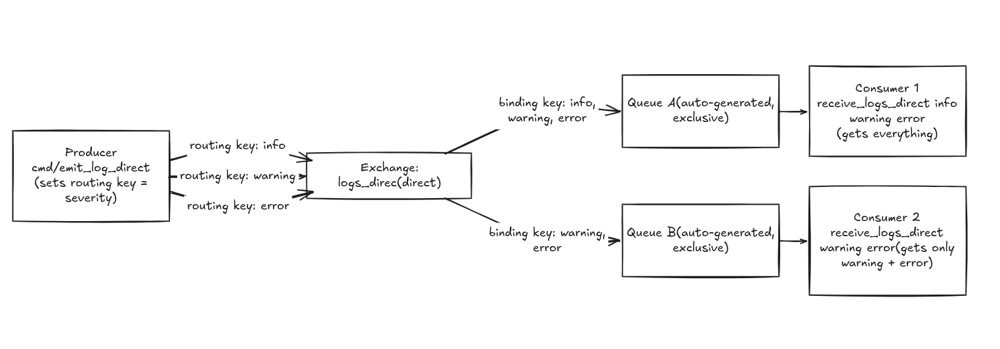
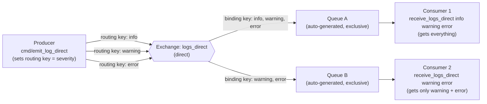
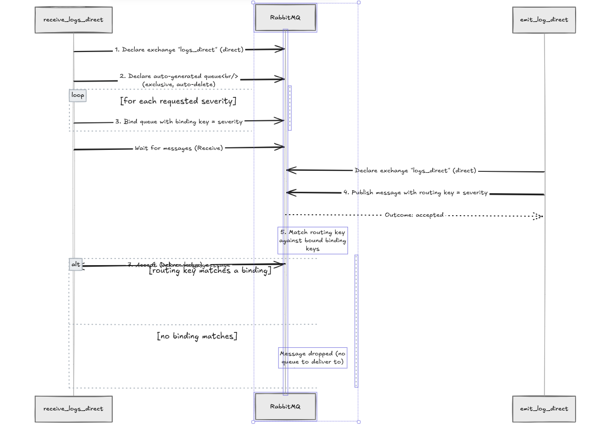
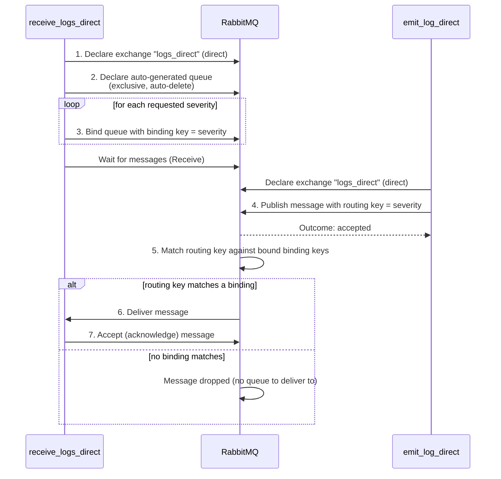

# RabbitMQ Routing Demo (Go, AMQP 1.0)

Tutorial 4 in the series. Builds on the [Pub/Sub demo](../pubsub-demo) —
same logging system idea, but now receivers can subscribe to only the
**severities they care about** (e.g. only `warning` and `error`)
instead of getting every message.

---

## 1. The core idea

Tutorial 3 used a **`fanout`** exchange: every message went to every
bound queue, no exceptions. That's great for "broadcast to everyone,"
but not when you want selective delivery — e.g. sending only critical
errors to a log file, while still watching everything on screen.

This tutorial swaps the exchange type to **`direct`**. A direct
exchange routes a message using its **routing key**: the message goes
only to queues whose **binding key** exactly matches that routing key.

```
Producer  --[routing key: "error"]-->  Exchange (direct)  --[binding key: "error"]-->  Queue  --->  Consumer
```

- **Routing key** — a label the *producer* attaches to each message
  when publishing (here, the log severity: `info`, `warning`, `error`).
- **Binding key** — a label the *consumer* attaches when binding its
  queue to the exchange (the severities it wants to receive).
- A direct exchange delivers a message only where routing key ==
  binding key. No match, no delivery — the exchange just drops it.

It's also legal to bind the **same** binding key to multiple queues —
in that case the direct exchange behaves like fanout *for that key*,
delivering to all of them.

### System diagram





Consumer 1 bound all three severities, so it gets everything —
functionally like tutorial 3's fanout. Consumer 2 only bound `warning`
and `error`, so `info` messages are routed straight past it. Same
exchange, same messages, different subscriptions.

## 2. What each program does

| File | Role |
|---|---|
| `cmd/emit_log_direct/main.go` | Producer. Declares the `logs_direct` **direct** exchange and publishes a message with the given **severity as its routing key**. |
| `cmd/receive_logs_direct/main.go` | Consumer. Declares the same exchange, creates its own private queue, then creates **one binding per severity** passed on the command line. |

The important change from tutorial 3 is in two places:

- **Publishing**: `ExchangeAddress{Exchange: "logs_direct", Key: severity}`
  — the `Key` is no longer empty; it's the routing key.
- **Binding**: instead of one binding with an empty `BindingKey`, the
  receiver loops over the severities given on the command line and
  creates a separate binding for each one.

### Project / setup flow





## 3. Prerequisites

Same as tutorial 3:

- **Go** 1.21+ installed (`go version` to check).
- **RabbitMQ** running locally with the AMQP 1.0 plugin enabled, on
  the default port `5672`.

  ```bash
  docker run -it --rm --name rabbitmq -p 5672:5672 -p 15672:15672 \
    rabbitmq:4-management
  docker exec rabbitmq rabbitmq-plugins enable rabbitmq_amqp1_0
  ```

  (Management UI, optional, at http://localhost:15672 — user/pass
  `guest`/`guest`.)

## 4. Project setup

```bash
cd pubsub-demo

# Only needed once — same dependency as tutorial 3
go get github.com/rabbitmq/rabbitmq-amqp-go-client
go mod tidy
```

## 5. Run it

**Terminal 1 — a receiver that wants only warnings and errors:**

```bash
go run ./cmd/receive_logs_direct warning error
# Binding queue to exchange logs_direct with routing key warning
# Binding queue to exchange logs_direct with routing key error
# [*] Waiting for logs. To exit press CTRL+C
```

**Terminal 2 — a receiver that wants everything:**

```bash
go run ./cmd/receive_logs_direct info warning error
# [*] Waiting for logs. To exit press CTRL+C
```

**Terminal 3 — emit some logs:**

```bash
go run ./cmd/emit_log_direct info "just checking in"
# [x] Sent [info] just checking in

go run ./cmd/emit_log_direct warning "disk usage climbing"
# [x] Sent [warning] disk usage climbing

go run ./cmd/emit_log_direct error "service unreachable"
# [x] Sent [error] service unreachable
```

Expected result: **Terminal 2** prints all three messages. **Terminal
1** prints only the `warning` and `error` ones — the `info` message
never reaches it, exactly as shown in the system diagram.

## 6. Code walkthrough

### Declaring a direct exchange (both files)

```go
conn.Management().DeclareExchange(ctx, &rmq.DirectExchangeSpecification{Name: "logs_direct"})
```

Same "declare = create if missing" idea as tutorial 3, just a
different exchange type. A different exchange **name** (`logs_direct`
instead of `logs`) is used too, purely so this demo can run
side-by-side with tutorial 3 on the same broker without conflicting.

### Publishing with a routing key (`cmd/emit_log_direct/main.go`)

```go
publisher, _ := conn.NewPublisher(ctx, &rmq.ExchangeAddress{Exchange: "logs_direct", Key: severity}, nil)
publisher.Publish(ctx, rmq.NewMessage([]byte(body)))
```

`Key` here is the routing key attached to every message this publisher
sends. We pass the severity read from the command line (`info`,
`warning`, `error`, or anything else you choose to use).

### Binding per severity (`cmd/receive_logs_direct/main.go`)

```go
for _, severity := range severities {
    conn.Management().Bind(ctx, &rmq.ExchangeToQueueBindingSpecification{
        SourceExchange:   "logs_direct",
        DestinationQueue: qInfo.Name(),
        BindingKey:       severity,
    })
}
```

This is the heart of the tutorial: one binding per severity the
receiver is interested in. The exchange checks a message's routing key
against every binding key on every queue — a match means delivery, no
match means the message just isn't routed there.

### Everything else

Connecting, declaring the private/exclusive/auto-delete queue,
creating the consumer, and the receive-loop-with-Accept pattern are
identical to tutorial 3 — see [`pubsub-demo/README.md`](../pubsub-demo/README.md)
for the line-by-line breakdown of those parts.

## 7. Next steps

Direct exchanges match routing keys **exactly**. The next tutorial
("Topics") introduces the `topic` exchange, which allows
wildcard-style matching (`*` and `#`) on multi-part routing keys —
e.g. subscribing to `kern.*` or `*.critical`.