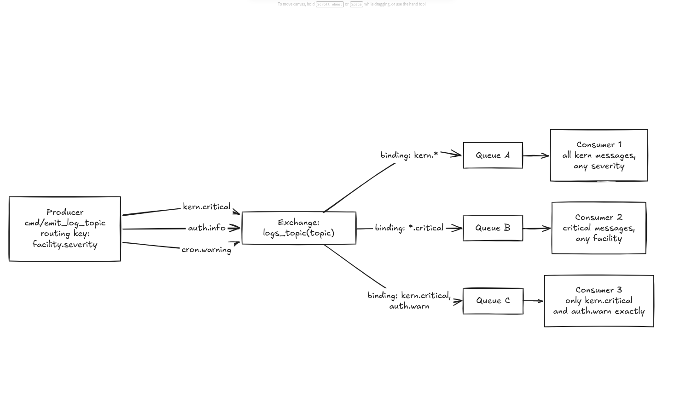
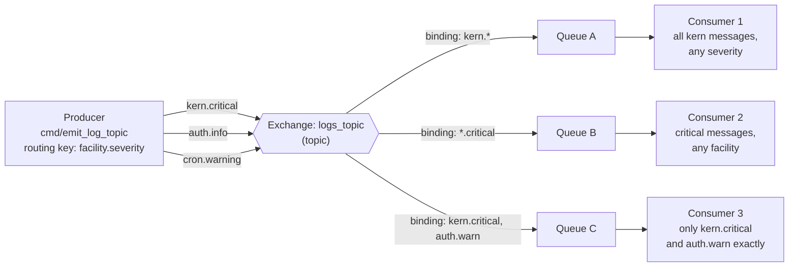
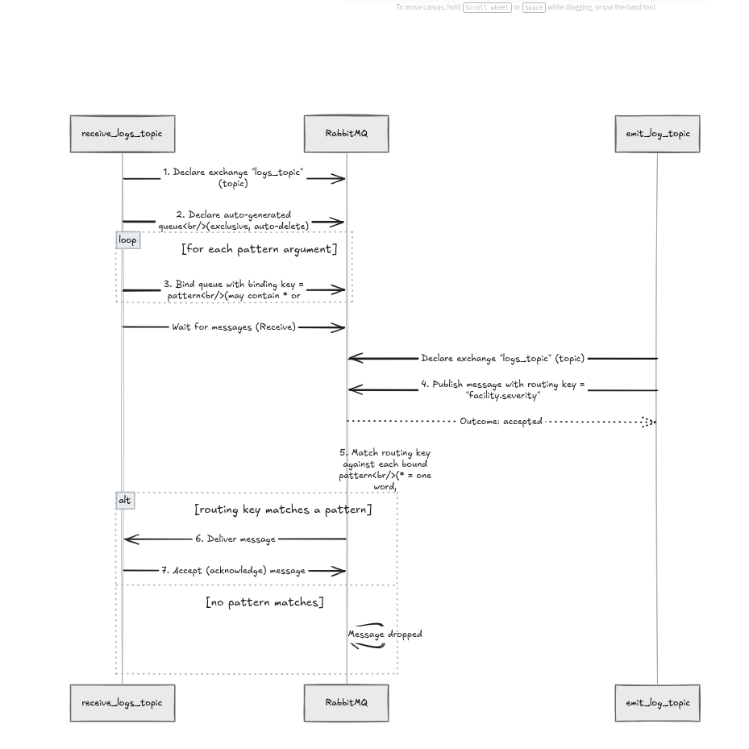
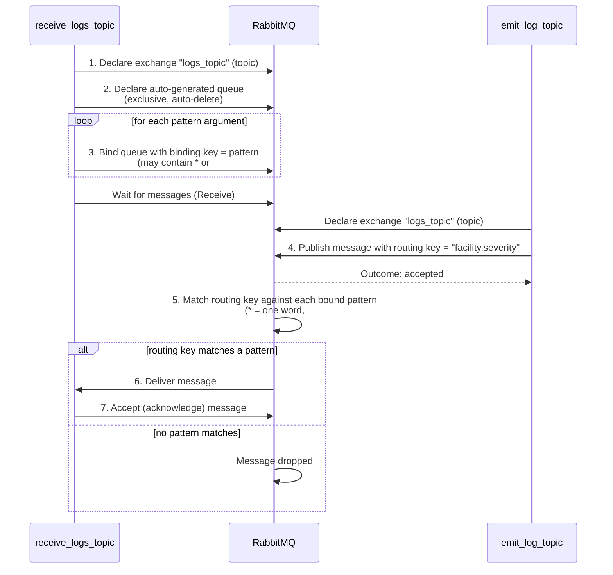

# RabbitMQ Topics Demo (Go, AMQP 1.0)

Tutorial 5 in the series. Builds on [Routing](./ROUTING.md) — same
logging system again, but now receivers can subscribe using
**wildcard patterns** instead of exact severity matches.

---

## 1. The core idea

Tutorial 4's `direct` exchange can only match a routing key **exactly**.
That's fine for "give me warnings and errors," but it can't express
something like "give me everything from the `kern` facility, whatever
the severity." For that we need multi-part routing keys and pattern
matching — which is what a **`topic`** exchange provides.

Routing keys become dot-separated, e.g. `"<facility>.<severity>"`:
`kern.critical`, `auth.info`, `cron.warning`. Binding keys can then use
two wildcards:

| Symbol | Matches |
|---|---|
| `*` | exactly **one** word |
| `#` | **zero or more** words |

If neither wildcard is used, a topic exchange behaves exactly like a
direct exchange (exact match only) — so tutorial 4's logic is really a
special case of this one.

### System diagram






Walking through what each consumer above actually receives from the
three published messages:

| Message | Consumer 1 (`kern.*`) | Consumer 2 (`*.critical`) | Consumer 3 (`kern.critical`, `auth.warn`) |
|---|---|---|---|
| `kern.critical` | ✅ (facility matches) | ✅ (severity matches) | ✅ (exact match) |
| `auth.info` | ❌ | ❌ | ❌ |
| `cron.warning` | ❌ | ❌ | ❌ |

Note `auth.info` and `cron.warning` don't reach *any* of these three
consumers — like tutorial 4, a topic exchange silently drops a message
if no binding pattern matches it.

### Project / setup flow





## 2. What each program does

| File | Role |
|---|---|
| `cmd/emit_log_topic/main.go` | Producer. Declares the `logs_topic` **topic** exchange and publishes a message with a dotted routing key (`facility.severity`). |
| `cmd/receive_logs_topic/main.go` | Consumer. Declares the same exchange, creates its own private queue, then creates **one binding per pattern** passed on the command line — patterns may contain `*` and `#`. |

Compared to tutorial 4, the code barely changes — `TopicExchangeSpecification`
instead of `DirectExchangeSpecification`, and the "severity" string
becomes a "facility.severity" string. All the wildcard logic is
handled entirely by RabbitMQ; the client code just passes the pattern
string through as-is.

## 3. Prerequisites

Same as tutorials 3 and 4:

- **Go** 1.21+ installed (`go version` to check).
- **RabbitMQ** running locally with the AMQP 1.0 plugin enabled, on
  the default port `5672`.

  ```bash
  docker run -it --rm --name rabbitmq -p 5672:5672 -p 15672:15672 \
    rabbitmq:4-management
  docker exec rabbitmq rabbitmq-plugins enable rabbitmq_amqp1_0
  ```

## 4. Project setup

```bash
cd pubsub-demo

# Only needed once — same dependency as tutorials 3 and 4
go get github.com/rabbitmq/rabbitmq-amqp-go-client
go mod tidy
```

## 5. Run it

**Terminal 1 — everything from the `kern` facility:**

```bash
go run ./cmd/receive_logs_topic "kern.*"
# Binding queue to exchange logs_topic with pattern kern.*
# [*] Waiting for logs. To exit press CTRL+C
```

**Terminal 2 — only critical severity, any facility:**

```bash
go run ./cmd/receive_logs_topic "*.critical"
# Binding queue to exchange logs_topic with pattern *.critical
# [*] Waiting for logs. To exit press CTRL+C
```

**Terminal 3 — two exact matches:**

```bash
go run ./cmd/receive_logs_topic "kern.critical" "auth.warn"
# Binding queue to exchange logs_topic with pattern kern.critical
# Binding queue to exchange logs_topic with pattern auth.warn
# [*] Waiting for logs. To exit press CTRL+C
```

**Terminal 4 — emit some logs:**

```bash
go run ./cmd/emit_log_topic kern.critical "disk controller failure"
go run ./cmd/emit_log_topic auth.info "user logged in"
go run ./cmd/emit_log_topic cron.warning "job took too long"
```

Expected results, matching the table above:
- **Terminal 1** (`kern.*`) prints only the disk controller message.
- **Terminal 2** (`*.critical`) also prints only the disk controller
  message (it's the only `critical` one).
- **Terminal 3** (`kern.critical`, `auth.warn`) prints the disk
  controller message too — `auth.info` doesn't match `auth.warn`
  exactly, so it's skipped.
- None of the three receivers see the `auth.info` or `cron.warning`
  messages, since no bound pattern matches them.

Try adding a fourth receiver bound to `"#"` alone — it will get every
message regardless of facility or severity, since `#` matches
anything (including zero words).

## 6. Code walkthrough

### Declaring a topic exchange (both files)

```go
conn.Management().DeclareExchange(ctx, &rmq.TopicExchangeSpecification{Name: "logs_topic"})
```

Same "declare = create if missing" pattern as the earlier tutorials,
just a different exchange type — and a different exchange name
(`logs_topic`) so this demo doesn't collide with `logs` (tutorial 3)
or `logs_direct` (tutorial 4) on the same broker.

### Publishing with a dotted routing key (`cmd/emit_log_topic/main.go`)

```go
publisher, _ := conn.NewPublisher(ctx, &rmq.ExchangeAddress{Exchange: "logs_topic", Key: routingKey}, nil)
```

`routingKey` here is a plain string like `"kern.critical"` — the dot
is just a convention for structuring the key into parts; RabbitMQ
doesn't know or care about "facility" and "severity" as concepts, it
only sees a string split on dots for wildcard matching purposes.

### Binding with wildcard patterns (`cmd/receive_logs_topic/main.go`)

```go
for _, pattern := range patterns {
    conn.Management().Bind(ctx, &rmq.ExchangeToQueueBindingSpecification{
        SourceExchange:   "logs_topic",
        DestinationQueue: qInfo.Name(),
        BindingKey:       pattern,
    })
}
```

Identical shape to tutorial 4's binding loop — the only difference is
what you pass in as `pattern`. The client doesn't validate or
interpret `*`/`#` at all; it just registers the string as a binding
key, and RabbitMQ's topic-matching logic does the rest when routing
messages.

### Everything else

Connecting, declaring the private/exclusive/auto-delete queue,
creating the consumer, and the receive-loop-with-Accept pattern are
unchanged from tutorials 3 and 4 — see
[`README.md`](./README.md) for the line-by-line breakdown of those
parts.

## 7. Next steps

This covers one-way messaging patterns — broadcast, selective
routing, and pattern-based routing. The next tutorial ("RPC")
introduces a *two-way* pattern: sending a request and waiting for a
reply, built on top of a private reply queue and a correlation ID.