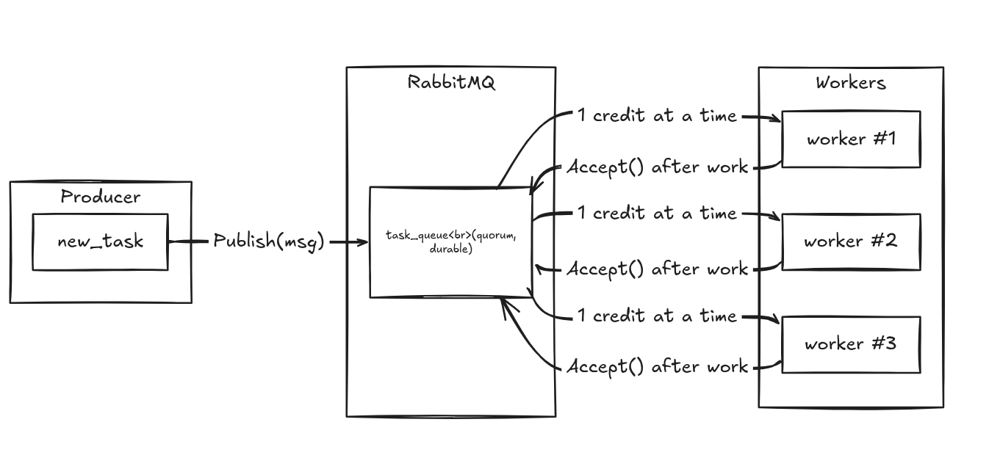
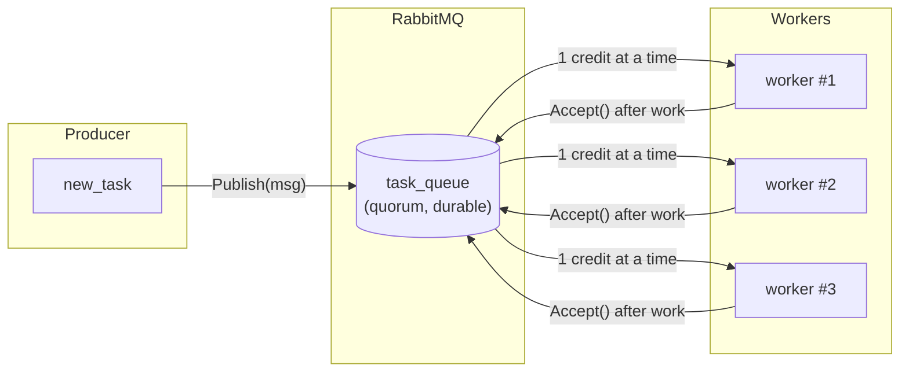
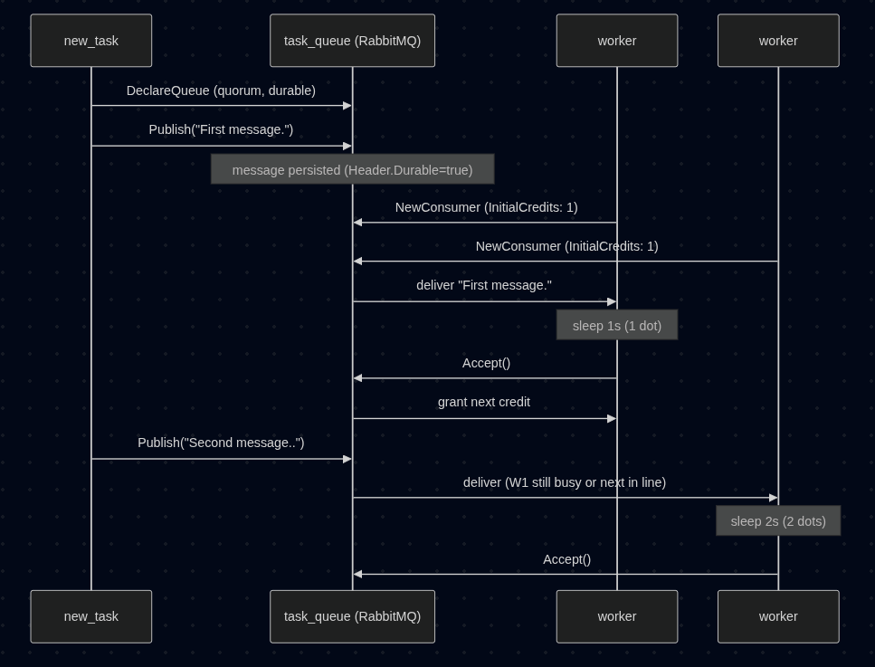
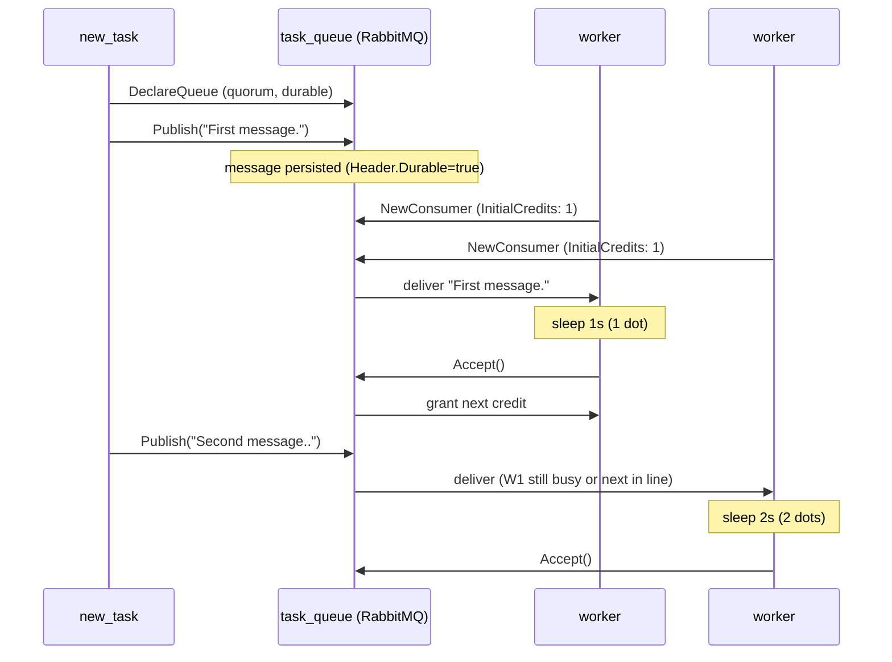

# Building a RabbitMQ Work Queue in Go (with the AMQP 1.0 client)

RabbitMQ's [Work Queues tutorial](https://www.rabbitmq.com/tutorials/tutorial-two-go)
teaches a core distributed-systems pattern: instead of one process
doing a slow task immediately, you drop it on a queue and let a pool
of workers race to pick it up. This post walks through implementing
that pattern in Go — but with `rabbitmq-amqp-go-client` (AMQP 1.0)
instead of the older `amqp091-go` client the official tutorial uses,
since that's what this project already had wired up from tutorial 1.

## The problem

Say you need to resize images, send emails, or crunch numbers —
work that takes seconds, not milliseconds. Doing it inline blocks
whoever's waiting. The fix: publish a "task" message and let
background workers consume it whenever they're free. Add more
workers, more parallelism — no code change.

## Overall flow







`new_task` publishes once and exits. Workers run forever, each pulling
one task at a time. Whichever worker finishes first gets the next
task — busy workers get skipped.

## Faking variable-length work

Real tasks vary in duration. Instead of wiring up real image
processing, the tutorial (and this implementation) fakes it: every
`.` in the message body = one second of `time.Sleep`. `"hello..."`
takes 3 seconds to process. Cheap way to see fair dispatch in action
without doing real work.

## Sequence: what happens end to end





The key detail: a worker only gets a new message after it explicitly
acknowledges (`Accept`) the previous one. That's what keeps dispatch
fair — RabbitMQ doesn't dump work on a busy worker just because it's
"next" in round robin.

## Three guarantees the tutorial cares about

**1. Durability — messages don't vanish on restart**

Two things need saving to disk, not just kept in memory: the queue
itself, and each message inside it.

- The queue: `QuorumQueueSpecification` builds a queue type that's
  replicated and durable by design — a RabbitMQ restart won't wipe it.
- Each message: this client stamps `Header.Durable = true`
  automatically on every publish. The old `amqp091-go` client makes
  you set `DeliveryMode: amqp.Persistent` by hand every time — easy to
  forget. Here it's on by default.

Think of the queue as a fireproof box and each message as a paper
inside it. Both need "don't lose this on a power outage" — the box is
fireproof by default here, and every paper gets auto-stamped "save
me" too.

**2. Manual acknowledgment — a crashed worker doesn't lose the task**

Normally a broker sends a message and immediately forgets about it. If
the worker crashes right after receiving but before finishing, that
task is just gone — nobody redoes it.

Manual ack fixes this: the broker keeps the message "on hold" until
the worker says "done" by calling `delivery.Accept(ctx)`. If the
worker dies before saying done, the broker notices and hands that
message to a different worker instead.

Like a waiter dropping off a food order and telling the kitchen
"still cooking, don't erase this ticket" — it only gets crossed off
when the food's actually done. If the waiter faints mid-cook, the
ticket's still on the board and someone else picks it up.

**3. Fair dispatch — don't dump everything on one worker**

Without this, RabbitMQ just hands out messages round-robin without
caring whether a worker is still busy from last time. Fast workers
finish and sit idle while one slow worker gets buried under ten tasks.

The fix: tell RabbitMQ "only give this worker one task at a time —
wait until it says done before handing over another." The old client
did this with `channel.Qos(1, 0, false)` (called *prefetch*). AMQP 1.0
doesn't have prefetch — it has link *credit*, same idea under a
different name. `InitialCredits: 1` means "1 task allowed at a time":

```go
consumer, err := conn.NewConsumer(ctx, "task_queue",
    &rmq.ConsumerOptions{InitialCredits: 1})
```

It's like a teacher handing out homework sheets one at a time per
student — don't give student #2 a new sheet until they've turned in
the first one, even if it's technically "their turn."

Leave `InitialCredits` unset and it defaults to 256 — RabbitMQ would
happily hand one worker 256 messages' worth of work up front
regardless of how long each takes, defeating fair dispatch entirely.

## Code layout

Two entry points can't share one Go package (`main` would collide),
so each lives in its own subpackage:

```
work_queues/
├── new_task/main.go   # producer — one-shot publish, exits
└── worker/main.go     # consumer — loops forever
```

Run with:

```bash
go run ./worker        # start as many of these as you want
go run ./new_task First task.
go run ./new_task Second task...
```

Start two or three `worker` instances, then fire off a few
`new_task` calls with different dot counts — you'll see the free
worker grab each new task while a busy one keeps grinding through
its current job.

## Takeaway

The pattern is provider-agnostic: publish once, let N workers
compete, ack only after real work is done, and cap in-flight credit
per worker so the queue self-balances. The API names change between
AMQP 0-9-1 and AMQP 1.0 clients (`Qos` vs `InitialCredits`,
`DeliveryMode.Persistent` vs default-durable `Header`), but the
distributed-systems idea underneath is identical.
